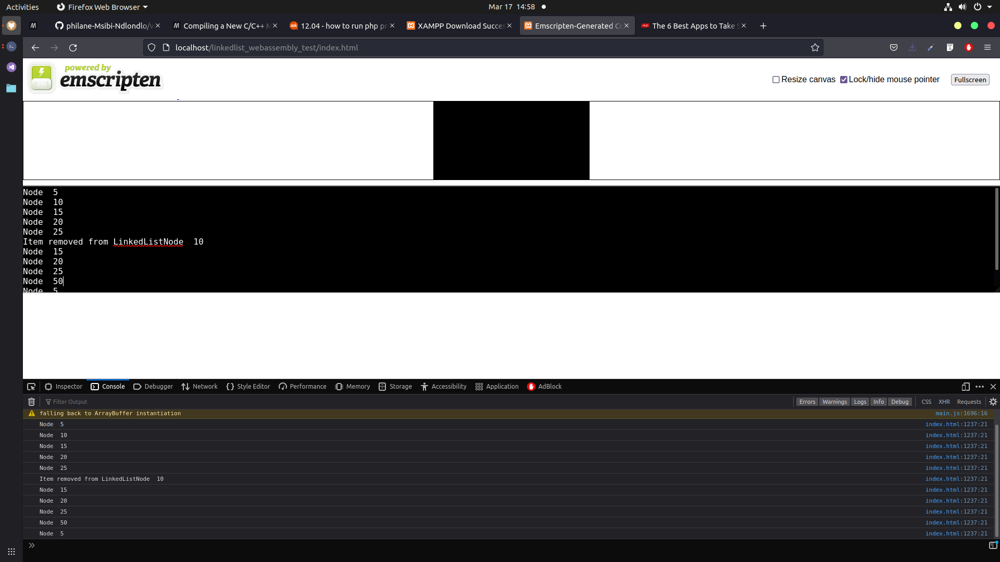

--

# Web Assembly using C LinkedList

Author: Philane Msibi

--

## Description

This is a test of how fast is C's Linkedlist operations on the browser using WebAssembly.
This project has a C file, containing code for a basic Singly Linked List. 
Emcc is used to generate the .wasm file to be used by the JS API called WebAssembly.
Our C code runs on the browser.
--



## Techs Used 

- C
- Emcc

## Linked List Snippet

```C
    LinkedList* list = createLinkedList();
   
    addNodeToLinkedList(list, 5);
    addNodeToLinkedList(list,10);
    addNodeToLinkedList(list,15);
    addNodeToLinkedList(list, 20);
    addNodeToLinkedList(list, 25);
 
    printLinkedList(list);
    
    removeNodeFromLinkedList(list, 5);
      
    addNodeToLinkedList(list, 50);
    addNodeToLinkedList(list, 5);
     
    printLinkedList(list);
     
    memcleanLinkedList(list);

```

## Contributions

Should you wish to contribute, PRs are accepted and discusses also.

